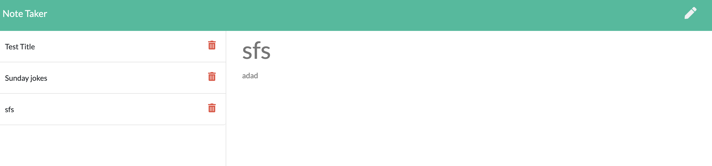

# noteTakerAppExpress
This app helps the user to create a note and save it and delete it.

## Contents
The user written and saved notes in browser are saved in db.json and in deletion it removed from db.json.

## usage
To use this applicaton, git clone this repository, run 'npm init' and npm install to install the following dependencies:

- Express

The app can be invoked using npm start or node server.js

## User Story
As a user, user wants something such that user can write the notes whenever user wants and delete the notes those were written before
## Links to the application
- Github repository link: (https://github.com/ManNeu/noteTakerAppExpress)
- Heroku deployed link; (https://note-taker-app-express-hw.herokuapp.com/)

## Screenshots

## Built With
- VS Code - (https://code.visualstudio.com/)
- Terminal
- Express
- Node

## License 
MIT License

## Author 
Manish Neupane  
Email: mrnish.are@gmail.com  
Github: https://github.com/ManNeu

